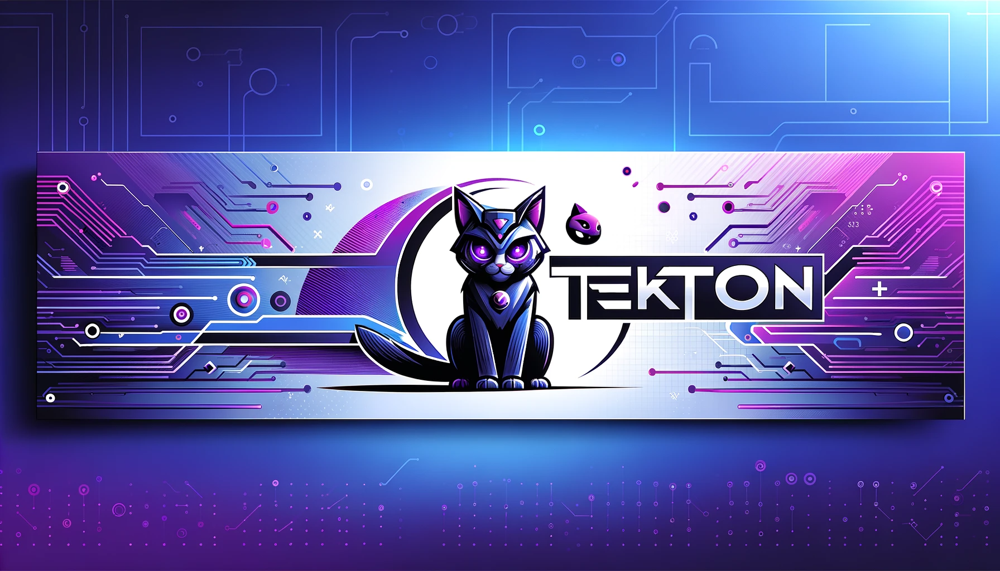

# Tekton Tutoriais: Domine o CI/CD com Kubernetes

Bem-vindo ao universo do Tekton, uma ferramenta para fazer o seu CI/CD em Kubernetes. Este repositório é um compêndio abrangente, oferecendo desde tutoriais básicos até técnicas avançadas, pretendo ir adiconando as minhas experiencias do uso da ferramenta. 

## O Que Você Encontrará Aqui?
Cada seção deste repositório é cuidadosamente elaborada para guiá-lo através de diferentes aspectos do Tekton, tornando-o um mestre na arte da automação de pipelines.

Também contém alguns projetos que eu achei por ai na internet.

## Tabela de conteudo

| ID | Nome | Link | Status |
|------|-------------------|---------------------------------------------------------------------------------------------------------------------------|--------|
| 010 | installTekton | [010](https://github.com/fbrunoviana/tekton/tree/main/010-installTekton) | ✅ |
| 020 | primeiroHello | [020](https://github.com/fbrunoviana/tekton/tree/main/020-primeiroHello) | ✅ |
| 030 | buildarDoGit | [030](https://github.com/fbrunoviana/tekton/tree/main/030-buildarDoGit) | ✅ |
| 040 | buildDeUmGitPrivado | [040](https://github.com/fbrunoviana/tekton/tree/main/040-buildDeUmGitPrivado) | ✅ |
| 050 | pushImage | [050](https://github.com/fbrunoviana/tekton/tree/main/050-pushImage) | ✅ |
| 060 | CD | [060](https://github.com/fbrunoviana/tekton/tree/main/060-CD) | ✅ |
| 070 | pipelinesBuilds | [070](https://github.com/fbrunoviana/tekton/tree/main/070-pipelinesBuilds) | ✅ |
